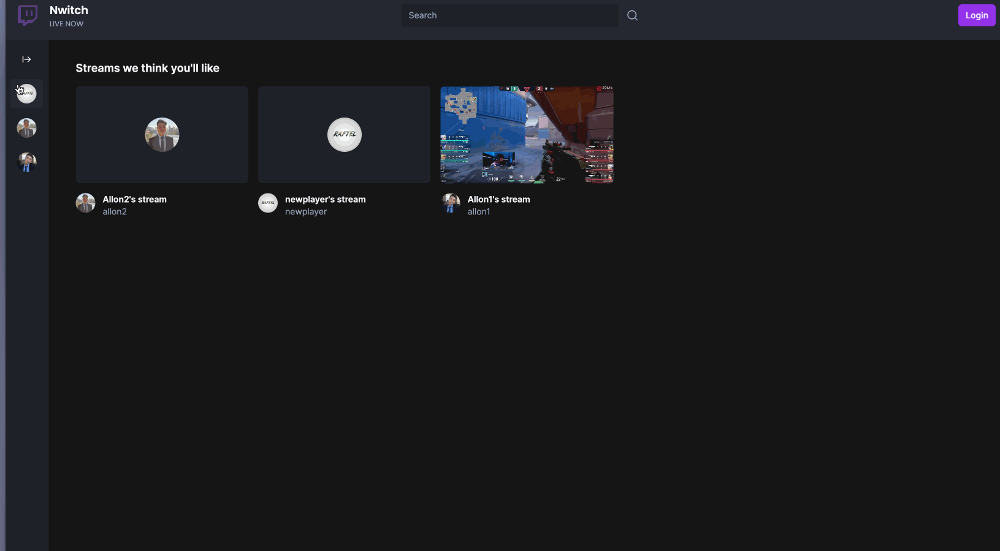
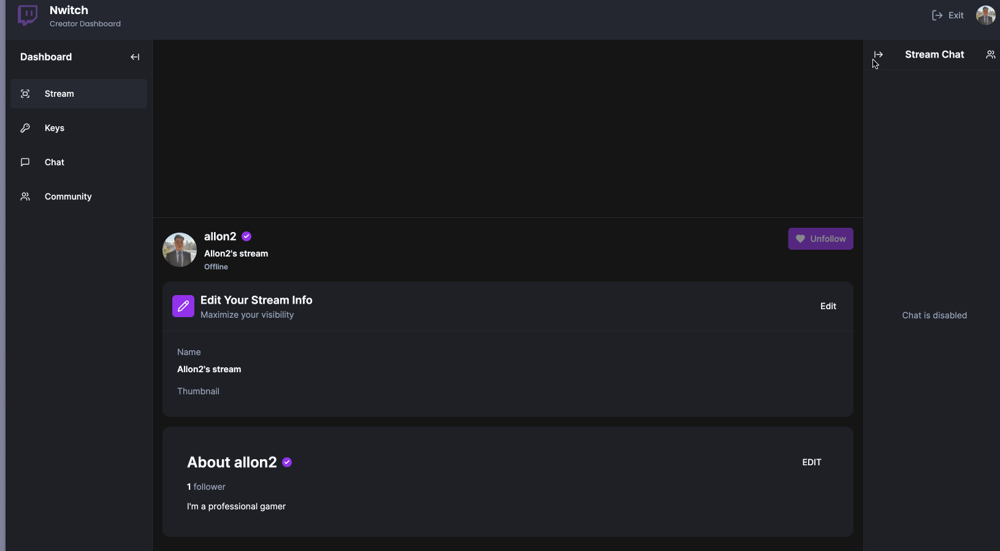
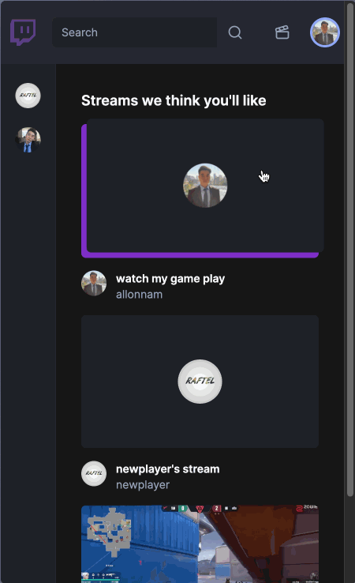

# Namcord

[LIVE](https://nwitch.vercel.app/)

## Overview
Nwitch is a fullstack clone of Twitch that enables platform where users can livestream and watch a wide range of content, including gaming, music, and talk shows.

## Key Features

### Frictionless Sign-up & Sign-in
Implemented the Clerk API for easy sign-up and sign-in, allowing users to login with their preferred method.

### Dashboard
User-friendly dashboard allows users to stream content that matches their preferences seamlessly.

### Streaming
With the help of the open-source software OBS, users can now watch their favorite streamers live.

### Blocking a viewer
Enhanced security features include the ability to block any malicious viewers from accessing your streams.

### Mobile Optimized
Frontend optimized for smaller devices such as tablets and mobile.

## Technologies
+ Languages: TypeScript, HTML/CSS
+ Frameworks: React, Next.js 14
+ Runtime: Node.js
+ Databases: MySQL
+ API: Clerk.IO, UploadThing, LiveKit, Webhook, Grok
+ Library: Socket.IO, TailwindCSS, Prisma (ORM), Shadcn UI, lucide-react

## Future Prospects
+ error handling when deleting & uploading thumbnail
+ error handling generating keys